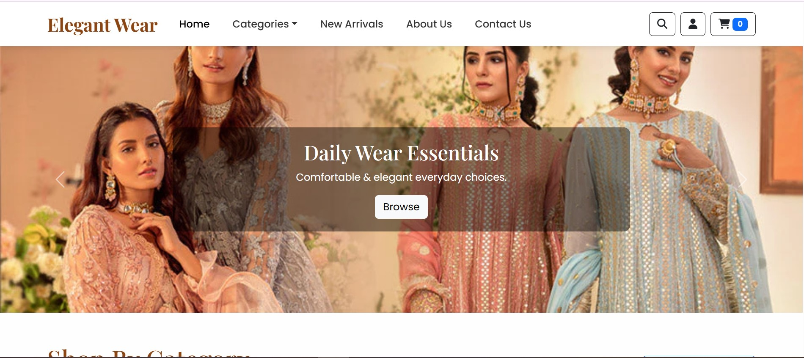
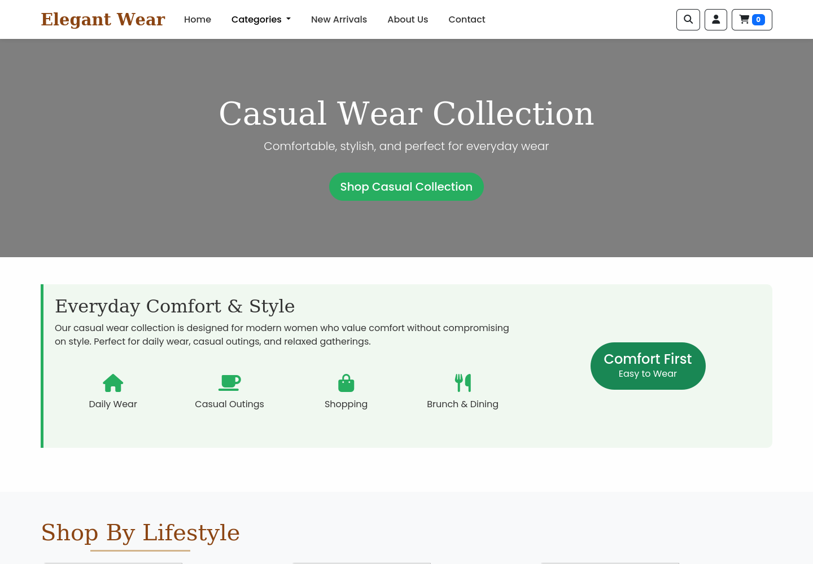
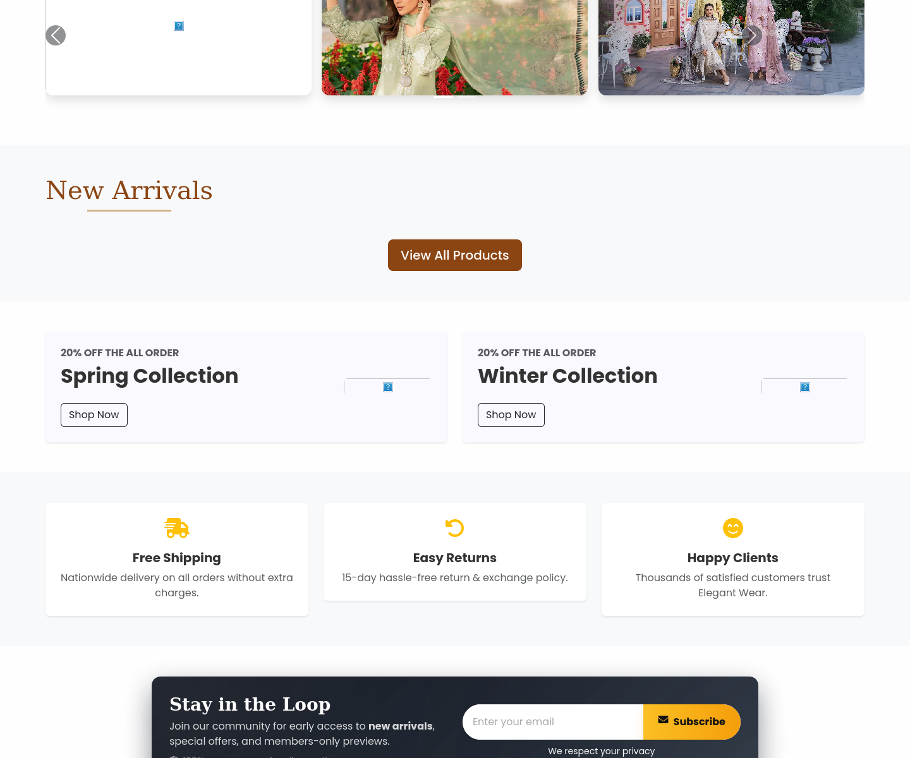
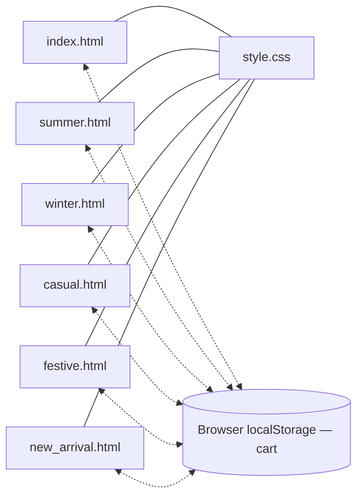

<div align="center">

# 👗 Elegant Wear
### Premium Unstitched Women's Clothing E-Store

**A modern, front-end fashion e-commerce showcase — built to simulate a real online clothing store**




</div>

---

## Table of Contents

- [About the Project](#about-the-project)
- [Screenshots](#screenshots)
- [Key Features](#key-features)
- [Tech Stack](#tech-stack)
- [Website Sections](#website-sections)
- [Project Structure](#project-structure)
- [Getting Started](#getting-started)
- [Roadmap](#roadmap)
- [Why This Project Matters](#why-this-project-matters)
- [Author](#author)
- [License](#license)

---

## About the Project

**Elegant Wear** is a front-end fashion e-commerce site for premium unstitched women's clothing. It's a static, client-side build — eight linked HTML pages, a shared stylesheet, and inline JavaScript for cart behavior — designed to look and feel like a real clothing brand's online store rather than a bare template.

The site combines a home page, category pages for each collection, a new-arrivals page, an about page, and a contact page, all sharing the same navigation, cart, and visual identity (Playfair Display for headings, Poppins for body text).

### Project Preview

Elegant Wear lets visitors explore fashion collections, browse categories, view featured products, and add items to a persistent cart. Main highlights include:

- Fashion-focused user interface
- Responsive layout for all devices
- Interactive product display
- Shopping cart with persistent state
- Promotional sections and testimonials
- Newsletter subscription section

---

## Screenshots

*Captured from the actual site.*

### 🏠 Home Page
The hero carousel, cart icon, and category navigation, all styled around the Elegant Wear brand identity.


### 🧥 Category Page — Casual Wear
Each collection gets its own landing page: a hero banner, a lifestyle blurb with icon callouts, and a dedicated product grid below.



### 📣 Promotions and Newsletter
Seasonal discount banners, trust badges (free shipping, easy returns, happy clients), and a newsletter signup, all on the home page.



---

## Key Features

| | | |
|---|---|---|
| 🎨 Elegant fashion-focused UI | 📱 Fully responsive (desktop, tablet, mobile) | 🛒 Persistent shopping cart |
| 🗂️ Category-based navigation | 🖼️ Dynamic product listing per collection | 🎠 Hero carousel with seasonal promos |
| 💬 Customer testimonials | 📧 Newsletter subscription | 🏷️ Promotional discount banners |

### Categories

The site is organized around distinct clothing collections:

- Summer Collection
- Winter Collection
- Casual Wear
- Festive / Party Wear
- New Arrivals

---

## Tech Stack

**Frontend**
- HTML5
- CSS3 (custom styles in `style.css`, layered on top of Bootstrap)
- Bootstrap 5.3
- JavaScript (inline, page-level — cart logic, carousel behavior)

**Libraries and Tools**
- Font Awesome 6.4 (icons)
- Google Fonts — Playfair Display (headings) and Poppins (body text)

All three are loaded via CDN, so an internet connection is needed for the styling and icons to appear correctly.

### How the Cart Works

Cart state is stored in the browser's `localStorage`, not on a server. That means:
- Items persist across page reloads and across every product page (home, summer, winter, casual, festive, new arrivals)
- The cart count in the navbar stays in sync as you browse
- There's no backend, so the cart doesn't survive a switch to a different browser or device — it's a front-end simulation, not a real checkout system



---

## Website Sections

### Navigation Bar
Quick access to categories (via dropdown), New Arrivals, About Us, and Contact — plus search, account, and cart icons.

### Hero Carousel
A full-width Bootstrap carousel highlighting seasonal collections and offers on the home page and on each category page.

### Shop By Category
Visually engaging category cards that help customers explore different clothing styles.

### New Arrivals
A dedicated page featuring newly added products with images, prices, and descriptions.

### Promotional Offers
Seasonal discount banners (e.g., "20% Off") and marketing sections to increase engagement.

### Features Section
Highlights store benefits — free shipping, easy returns, and customer satisfaction — each with its own icon.

### Newsletter
A "Stay in the Loop" signup section encouraging visitors to subscribe for updates and exclusive offers.

### Testimonials
A customer feedback section on the home page that builds credibility.

### Footer
Social links, contact information, and store navigation links.

---

## Project Structure

```text
Elegant-Wear/
├── index.html            # Home page — hero, categories, promos, testimonials, newsletter
├── about.html             # About page
├── contact.html            # Contact page
├── summer.html               # Summer Collection
├── winter.html                 # Winter Collection
├── casual.html                   # Casual Wear
├── festive.html                    # Festive / Party Wear
├── new_arrival.html                  # New Arrivals
├── style.css                           # Shared custom styles (layered on Bootstrap)
├── images/                               # Hero, category, and about images
└── README.md
```

> **Note:** Cart and carousel logic live in inline `<script>` blocks on each page rather than a single shared `script.js`, and all HTML files sit at the repository root rather than in a `pages/` subfolder.

---

## Getting Started

No build step, no dependencies to install — it's a static site.

### 1. Clone the repository
```bash
git clone https://github.com/Ali-Hassan-542/Elegant-Wear.git
```

### 2. Open it
Open `index.html` directly in your browser, or serve the folder locally:
```bash
cd Elegant-Wear
python3 -m http.server 8000
```
Then visit `http://localhost:8000`.

> An internet connection is needed on first load — Bootstrap, Font Awesome, and Google Fonts are all loaded via CDN rather than bundled locally.

---

## Roadmap

Planned enhancements beyond the current front-end showcase:

- 🔐 User authentication
- 🛠️ Admin dashboard
- 🗄️ Product database (products are currently hard-coded in each page)
- 💳 Online payment integration
- 📦 Order tracking
- 🔎 Product filtering and search
- ❤️ Wishlist feature
- 👤 Customer accounts

Also worth a quick fix: the **Formal Wear** and **Party Wear** entries in the Categories dropdown currently point to a `party-wear.html` page (and a `#formal-wear` anchor) that don't exist yet — pointing them at an existing collection page, or building the two pages out, would clear that up.

---

## Why This Project Matters

This project demonstrates how a modern online store can be built using front-end technologies alone. It focuses on real-world UI design, responsive layouts, and the interactive elements used in professional fashion e-commerce websites — persistent cart state, multi-page navigation, and promotional/marketing sections included.

It's well suited for:

- Web development portfolios
- University projects
- Front-end practice
- UI/UX demonstrations

---

## Author

**Ali Hassan**
Front-End Web Developer

---

## License

This project is open source and available under the **MIT License**.
